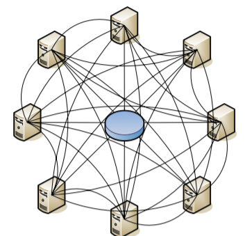

# TermiTorrent
Yes, you read that right. This time it will be a torrent client. 

So, here's the plan.
I have most of my projects done with creating a back end, doing something and again creating a back end doing something different. However, a few days ago I wanted to know the difference between (mu)torrent and BitTorent, and I came to know that BitTorent is just a protocol to transfer content while the former is a client which uses this protocol to send and receive the content.

With this new repo started, *your friendly neighborhood NodeFan* would be first going through how BitTorrent works in a very Layman's way then for a few days I will be putting details about the main aspects of the protocol.

It will take (I don't know how long) until I find a good way to get the actual implementations done.

# Part 1 - Introduction

BitTorrent is a hybrid **peer-to-peer** file-sharing protocol designed by Bram Cohen, where *a central entity is necessary to provide parts of the offered network services*.

 
|   | 
|:--:| 
| *BitTorrent Architecture* |

What this means is that the network consists of several peers. Peers are nothing but the machines participating in the sharing process which upload and download files.

This doesn't mean that there is an absence of a moderator. This moderator is called **tracker** in the terminology of the protocol. However, the role of the tracker is minimal.

The BitTorrent architecture normally consists of the following entities:   
- a static metainfo file (a torrent file)
- a tracker
- an original downloader (seed)
- the end user downloader (leecher)

Let's have a look at how your file gets downloaded when you use a Bittorent client :
1. Your client reads the .torrent file
2. It then contacts a server (tracker)
3. Tracker responds with a list of peers which have the file(s) you want
4. Your client then connects to some peers and asks for chunks of the file(s)

So this is all that happens behind the scenes. It is worth to note that unlike other servers, the tracker is not as useful. This is because your request is fulfilled by peers and not the tracker.

BitTorrent is designed to facilitate file transfers among multiple peers across unreliable networks. 

|  | 
|:--:| 
| *Basic Workflow* |


# Part 2 - Metafile

The first thing that one must do in order to act as a Bittorent client is to be able to understand the **metafile** or the **.torrent**.

As suggested by its name, metafile contains metadata or the data about the data you want. So what should this metafile contain?
- Tracker's url (aka announce url)
- Path details of the files requested

Well, that's true but the story is not that straight. 

As we know, we gather chunks of requested file from various peers. This means, that we need a way to validate that each chunk acquired is indeed correct. This is again done with the help of the metafile. 

The metafile contains hashed [SHA-1] values for each of these chunks. Once the client receives a chunk, it hashes it and compares it to the 20-byte long hash corresponding to it in the metafile. So the list extends as : 
- length(s) of the file(s)
- lengths of the chunks
- SHA-1 hash values corresponding to the chunks/blocks

Apart from these it also contains information like date of creation, author, etc. For a detailed list click [here](https://wiki.theory.org/index.php/BitTorrentSpecification#Metainfo_File_Structure). The detailed list would be used later.

**- sample metafile :**
```
d8:announce43:udp://tracker.coppersurfer.tk:6969/announce10:created by13:uTorrent/187013:creation datei1462355939e8:encoding5:UTF-84:infod6:lengthi124234e4:name9:puppy.jpg12:piece lengthi16384e6:pieces160:TâkŠ/„_(ÁSh%°Ïð+]q'BîÙ :°öïp"¶j–‡ü§1-g"¼s(š›ŒVÃð=•h¯maœnF¯2ý…°N
·Ç©Ô_‘"2ûþ¤'‘wOåì•-;×¢µØ‘šºL&ùÕðó0ëD_9·í	\¨Oæh,n5gØ(©‘仑,•\ß°¥%¼šU†äžC>ØÙdf†¯ee
``` 

### Bencoding

The metafile which contains all this is not a normal text file. It is 'bencoded'.
Bencoding is a way to specify and organize data in a terse format. It supports the following types: byte strings, integers, lists, and dictionaries. 

The idea is the same as that of JSON. The difference only lies in the way data is formatted.

Basically there are delimiters which are alphabets denoting information like starting or ending of the supported data types.

- "<string length encoded in base ten ASCII>:<string data>" for byte strings
- "i<integer encoded in base ten ASCII>e" for integers
- "l<bencoded values>e" for lists
- "d<bencoded string><bencoded element>e" for dictionaries

For a more detailed guide on bencoding click [here](https://wiki.theory.org/index.php/BitTorrentSpecification#Bencoding).


# Part 3 - A discussion on protocols

So now have an overview of how things are happening and from where to gather information to request a file. Hence it is a good time to look at how communications take place and what protocols are used.

1. Client to tracker - **User Datagram Protocol (UDP)**
2. Client/Peer to peer - **Transfer Control Protocol (TCP)**

As you may have seen in [wiki.theory](https://wiki.theory.org/index.php/BitTorrentSpecification#Tracker_HTTP.2FHTTPS_Protocol), originally HTTP was used. However, the use of HTTP induces a significant overhead, which is reduced by the usage of UDP. This is a direct result of the guarantee that HTTP provides that is reliable and in-order delivery of data from sender to receiver. Since communication with the tracker involves the metafile only, which is typically about 100-bytes large, such reliability is not required. However, this also means that peer-to-peer communication must not be based on UDP, hence it works on TCP.

This is also a good time to explain why the tracker URL is also called the announce URL. Since, before the client's first message to the tracker, it is unknown to the connection of peers, with this URL, the new client announces about itself to the existing peers.

### UDP in depth

The tracker's load gets decreased by about 50% with UDP in lieu de TCP. This is a large gain for the server/tracker.
Although the 4 packets sent can be reduced to 2, these may raise security concerns since a malicious program may spoof the source address of the UDP packet. To prevent this, a connection ID is calculated by server and sent back, which is later required as verification (which works well in the absence of a sniffer).

For more details on connection ID and time-out specification [here](http://www.bittorrent.org/beps/bep_0015.html) is a detailed document on UDP.

# Part 4 - More on Chunks: Blocks and Pieces

So far what we know about the information we receive is that we get chunks of files from peers which are then verified with the help of their own SHA-1 hashed values form the metafile. But there is indeed more to it. 

Initially I had been using the word 'chunk' to avoid any confusion arising between the actual terms - blocks and pieces.

**Blocks** are those portions of files which are actually sent over the network.

**Pieces** are the (larger) portions of files which are verified by the SHA-1 hashed values in the metafile.

This also directly implies that blocks are fragments of pieces, and whenever our Bittorrent client requests something, it is indeed a block and not a piece.

# Part 5 - Getting the Peer List

[Note] This part onward we'll look at how we sent our messages and requests to the tracker and clients. Specifically, this part is dedicated to the UDP Protocol.

In this part we look at what should our message look like when we announcing our existence to the tracker in order to get a list of our peers.

As with any other network some protocol has to followed which involves several request-response pairs. In this case we have the UDP protocol. Briefly, following is done: 
- connecting with tracker     (request)
- obtaining the connection id (response)
- sending announce request    (request)
- obtaining the list of peers (response)

The protocol also says that all values are sent in big endian format and packets are not expected to be of fixed length.

I advise you to refer to [the official protocol](http://www.bittorrent.org/beps/bep_0015.html) as you proceed. 
Now diving into the details of each message listed above.

## 1. Connection Request

Before any peer list is received, a connection ID needs to be obtained, the significance of which is explained in Part 3.

The connection request is simple in structure. As [BEP](http://www.bittorrent.org/beps/bep_0015.html) describes,
we need to pass:
- protocol_id --> value - 0x41727101980
- action        --> value - 0 (which stands for connect)
- transaction_id --> value - random 4-byte integer

## 2. Connection Response

The request is also simple and we receive our first piece (not that piece) of information - the connection ID. Our response contains:
- action        --> value - 0 (which stands for connect)
- transaction_id --> same as the one we sent
- connection_id --> 8-byte integer

A good client must always verify the returned transaction_id to be the same as the one sent.

A thing which is prevalent here but we wouldn't be often is that the sizes of both the messages sent and received are constant.
Also if you went through BEP, you might have noticed the offset in messages. Don't worry about them now, we require them while implementation.

## 3. Announce Request

Once the connection ID is obtained, one can request the tracker for the list of peers. The announce request consists of a larger set of parameters sent to tracker discussed below. However, for exact specification, one must refer to BEP:
- **connection_id** --> one obtained above
- **action** --> value - 1 (which stands for announce)
- **transaction_id** --> random 4-byte integer
- **info_hash** --> SHA-1 hash value of info dictionary in the metafile
- **peer_id** --> a unique ID to identify your client in the network
- **downloaded** --> the number of byte you've downloaded in this session.
- **left** --> the number of bytes you have left to download until you're finished
- **uploaded** --> he number of bytes you have uploaded in this session
- **event** --> 0 - none (there are other events also)
- **ip** --> your ip (0)
- **key** --> a unique key randomized by the client
- **num_key** --> max number of peers you want in the reply, -1 for default
- **port** --> your listening port

One must note here that the info hash is the most important parameter. This is nothing but the hash value of the info dictionary in the metafile. Hash value is sufficient because the chances of two metafiles having same info hash is very low and so is practically usable to uniquely identify what one wants.
With this, the tracker can send the list of peers.

Peer ID is the parameter which uniquely identifies your client in the network. The various conventions and popular clients' ID can be viewed [here](https://wiki.theory.org/index.php/BitTorrentSpecification#peer_id).

Another thing is the ip. In general this parameter is not necessary as the address of the client can be determined from the IP address from which the HTTP request came. The parameter is only needed in the case where the IP address that the request came in on is not the IP address of the client. This happens if the client is communicating to the tracker through a proxy (or a transparent web proxy/cache.) It also is necessary when both the client and the tracker are on the same local side of a NAT gateway. The reason for this is that otherwise the tracker would give out the internal (RFC1918) address of the client, which is not routable. Therefore the client must explicitly state its (external, routable) IP address to be given out to external peers.

Finally, the official spec says that the ports for bittorrent should be between 6881 and 6889.

## 4. Announce Response

Server responds in the following fashion:
- **action** --> 1
- **transaction_id** --> must match the above transaction ID
- **interval** --> no. of seconds you should wait until re-announcing yourself
- **leechers** --> no. of non-seeder peers (integer)
- **seeders** --> no. of peers with the entire file (integer)
- Followed by a variable number of **ip-port** pairs of peers 

##

### # Other things to take care of

Although things are straight forward, life is not so easy. UDP is an unrieble network which means that it is the responsibility of the client/application that the a response is indeed received. It is not a grave matter if you don't receive a response.

Such concerns are tackled by reattempting a request after some time  of waiting. This sometime is suggested by BEP as 15*(2^n) seconds with n going from 1 to 8. This is called **exponential backoff** done to balance the concerns of the message being lost or being delayed due to heavy traffic. For the former problem we would want to reattempt as quickly as possible while for the latter we may not want to spam the server and instead wait.

### # Some references

If you are more interested, you may go through this : 
- [Protocol packet descriptions](https://www.rasterbar.com/products/libtorrent/udp_tracker_protocol.html)
- [Extensions for UDP](http://bittorrent.org/beps/bep_0041.html)
- [BEP](http://www.bittorrent.org/beps/bep_0015.html)

# 5. Downloading Files

Now we are at theoretically final stage towards our goal. Having the peer list in hand, we now have to adhere to the Transmission Control Protocol (TCP) to converse with the peers.

Before directly asking for some blocks, we have to create the connection and perform some handshaking. Then we would be ready to gather pieces for various peers. The more the peers, the faster the download (up to a limit).

Note that TCP is different from UDP in the sense that a connection is made between us and the peers.

## 1. Handshaking

The first message sent by the client must be this handshake message.

*handshake: <pstrlen> <pstr> <reserved> <info_hash> <peer_id>*
- **pstrlen**: string length of <pstr>, as a single raw byte
- **pstr**: string identifier of the protocol
- **reserved**: eight (8) reserved bytes. All current implementations use all zeroes. Each bit in these bytes can be used to change the behavior of the protocol
- **info_hash**: 20-byte SHA1 hash used in UDP also
- **peer-id**

In version 1.0 of the BitTorrent protocol, pstrlen = 19, and pstr = "BitTorrent protocol". Also if the initiator of the connection receives a handshake in which the peer_id does not match the expected peer-id, then the initiator is expected to drop the connection.

### Peer Relations / States Between Peers

A handshake does not guarantee that a client would be actually requesting pieces from that peer. Here there are parameters telling the willingness of our client to request/respond and that of peer to request/respond. 

Particularly, a client may want to **choke** a peer when it is responding various other peers already. Similarly, it may **unchoke** a peer as well. 

A client is said to be **interested** in a peer if that peer contains some piece that the client wants. Analogously, it may be **not interested** in those peers which do not possess any required information.

It should also be noted that each peer has perfect information, i.e., for any pair of peer(client) and peer each knows if the other one is interested in it or if it has choked it, in addition to what it thinks about that peer.

## 2. Message Formats

Once done with the handshaking, messages for defining the states of interest, availability of packets, requesting for blocks, responding with blocks and cancelling requests can be transmitted to and from the responding peer.

The format of messages is as below and the actual context and content is in the payload.

*<length_prefix> <message_id> <payload>*
- length prefix is a 4-byte integer indicating the length of message excluding these 4 bytes
- single byte decimal value
- some messages do not have payload

Following are the various messages:
- **keep-alive** - *<len=0000>*
- **choke** - *<len=0001><id=0>* 
- **unchoke** - *<len=0001><id=1>* 
- **interested** - *<len=0001><id=2>* 
- **not interested** - *<len=0001><id=3>* 
- **have** - *<len=0005><id=4><piece index>* 
- **bitfield** - *<len=0001+X><id=5><piece index>*
- **request** - *<len=0013><id=6><index><begin><length>*
- **piece** - *<len=0009+X><id=7><index><begin><block>*
- **cancel** - *<len=13><id=8><index><begin><length>*
- **port** - *<len=0003><id=9><listen-port>*

The meanings of the first five types of messages are self-explanatory. It is also obvious that they do not require any payload. 

The payload of the *have* message is the zero-based index of a piece that has just been successfully downloaded and verified via the hash. 

The *bitfield* message is variable length, where X is the length of the bit field. The payload is a bit field representing the pieces that have been successfully downloaded. The high bit in the first byte corresponds to piece index 0. Bits that are cleared indicated a missing piece, and set bits indicate a valid and available piece. Spare bits at the end are set to zero. 

The *request* message requests for a block of data which is described with the piece index of which that block is a part, and the offset and length within that piece.

The *piece* message is a response to the *request* message with information of piece number, offset within the piece and the block data. X is the length of he block.

The *cancel* message is used to cancel block requests.

## 3. Requesting Pieces

Now, all that we need to do is ask for pieces, since we know the form of messages we will be sending and receiving. However, pieces are not requested arbitrarily. Following are some ways for requesting:
- As soon as we come to know about the pieces a peer has, we can directly ask for all those pieces which we do not have. But this becomes as bad as transferring data from a single source in case of speed which is against the spirit of the BitTorrent idea.
- We could also divide the pieces almost equally among the peers. However, this does not give us a good chance to exploit the speeds a few peers are blessed with. The slowest peer can become the bottleneck.
- Another good strategy can be asking for a piece from any peer as soon as it is free. (I will be implementing this)

However, most of the professional software applications use the following strategy. 
1. **Random start**: A few (typically 1 piece) is requested randomly.
2. **Rarest first**: One does not know how long a peer may remain in the swarm. In such cases it becomes essential that a random piece be downloaded first. Hence, peers with rare pieces are sent request for those.
3. **Endgame**: It may be possible that the last remaining pieces have been requested from the slower peers instead of the faster ones, the latter ones remaining free. What endgame suggests is to request the remaining few pieces from all the peers and cancel from others as one peer arrives with the message.

## Changelog
[Read the changelog here 🡒](https://github.com/ShivanshMishra18/TermiTorrent/blob/master/CHANGELOG.md)

## Features to be added
- [ ] Develop a GUI for entire workflow
- [ ] Support the feature of uploading files to the network
- [ ] Decrease dependency on Seeder by utilising trackers as Leecher

## License
[MIT](https://choosealicense.com/licenses/mit/)
